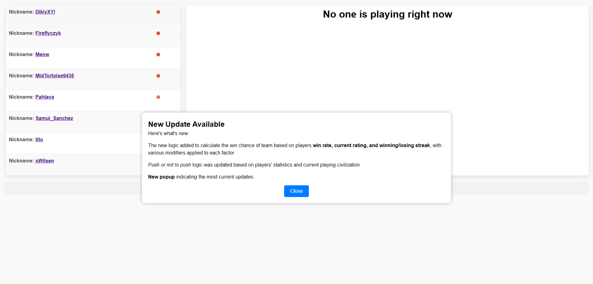
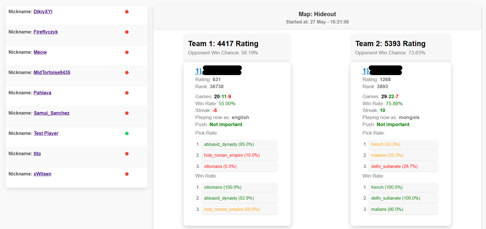
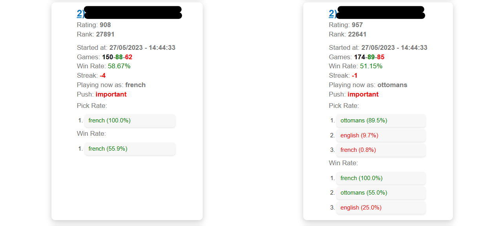

# Age of Empires 4 Game Tracker

Track the games and performance of Age of Empires 4 players in real-time. Get live updates and stats on player rankings, win rates, and more.
You can find an example of how the app looks [here](https://age-of-empires-4-game-tracker.vercel.app/)!

## Description

This project is a web application that allows you to track the games and performance of Age of Empires 4 players. It provides real-time updates on player rankings, win rates, and other statistics.

## Screenshots

## Features

- Real-time tracking of Age of Empires 4 player games and performance
- Live updates on player rankings, win rates, and more
- Detailed player information including rating, rank, games count, wins count, streak, civilization, and more
- Visualization of player win rates and pick rates for different civilizations
- Team win chance calculation based on players' win rates, current rating, and winning/losing streak
- Responsive and user-friendly interface

## Technologies Used

- HTML
- CSS
- JavaScript

## Known Issues
1. Win chance is calculated incorrectly: The current algorithm for calculating win chances may produce inaccurate results in certain scenarios. I am actively working on improving this calculation method.
2. Not possible to track players if they are playing simultaneously different games: The current version of the application does not support tracking players who are playing different games simultaneously. I am investigating possible solutions to address this limitation.

Please feel free to report any other issues you encounter by creating a new issue. I appreciate your feedback and contributions in making this application better.

## Roadmap
#### Version 1.0

- [X] Implement basic player tracking functionality
- [X] Display player rankings, win rates, and game statistics
- [X] Calculate team win chances based on player data
- [X] Support for manual player updates

#### Version 1.1

- [X] Integrate real-time updates for player game information
- [X] Improve user interface and styling
- [ ] Add support for tracking multiple teams and players simultaneously
- [ ] Enhance player search and filtering capabilities

#### Version 1.2

- [ ] Implement data visualization features (charts, graphs)
- [ ] Introduce player comparison functionality
- [ ] Add support for tracking tournament results
- [ ] Enhance performance and optimization of the application
- [ ] Future Releases
- [ ] Expand platform support (mobile, desktop)
- [ ] Implement social features (leaderboards, player profiles)
- [ ] Integrate notifications for important player events
- [ ] Enhance data analytics and insights
- [ ] Support for localization and multiple languages

Please note that the roadmap is subject to change as the project progresses and new ideas emerge. It serves as a general guideline for future development plans and features, providing users with an overview of what to expect in upcoming releases.

## Credits
This project was developed by [Yury Filipovich](https://www.linkedin.com/in/yury-filipovich/) with the data from [AOE4 World](https://aoe4world.com/).

## License and rights

All of this data is open source, you may use it in your projects, websites and apps. However, Microsoft owns the Copyright on the game, and for this reason you can't use this data in commercial contexts, excepts as described in Microsoft's [Game Content Usage Rules](https://www.xbox.com/en-US/developers/rules). Whenever you are using the data in this repository or other media from Age of Empires 4, please make sure to abide by the rules.

> Age Of Empires 4 © Microsoft Corporation.
> Aoe4world/data was created under Microsoft's "[Game Content Usage Rules](https://www.xbox.com/en-US/developers/rules)" using assets from Age Of Empires 4, and it is not endorsed by or affiliated with Microsoft.
